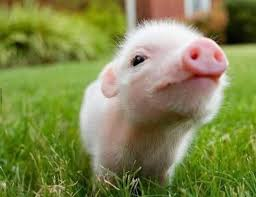

# Test Case 200496: [SEO Validation][Standard]: Verify suggestion reported for duplicated image alt text(html Syntax)

## 1. Against the rule

### 1.1 Html image tag

### 1.2 Image tag in html container

### 1.3 Line break

### 1.4 Empty source

### 1.5 Multiple alt text (Use first alt text)

### 1.6 Multiple source (Use first source)

## 2. Follow the rule
### 2.1 Alt text attribute in other html element

### 2.2 Empty alt text

### 2.3.1 Multiple source (Use first source) report suggestion

### 2.3.2 Multiple source (Use first source) Not report suggestion

### 2.4 Unique alt text

--------------------------------------------------
Result: 
    "test alt text": 6
    "test alt text 1": 2
    "test alt text 3": 2
